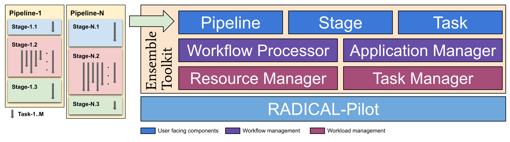
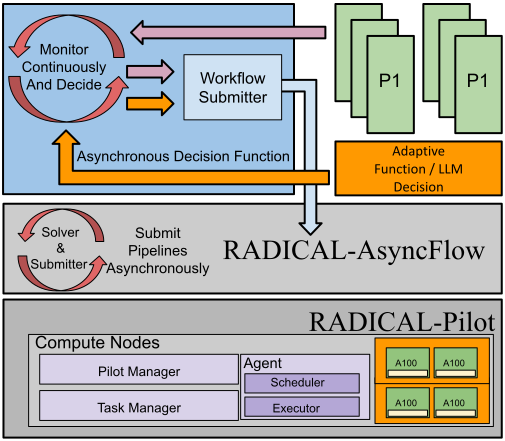

# RADICAL Cybertools

**Promoting a Standards-Based, Abstraction-Driven Approach to High-Performance 
and Distributed Computing**

The RADICAL Cybertools (RCT) are a suite of software systems that facilitate 
the design and execution of complex scientific workflows on high-performance 
computing (HPC) platforms. RCT takes care of the hard parts of 
execution—acquiring resources, managing heterogeneous tasks, and scaling to 
leadership-class HPC platforms—so that researchers can focus on their science 
rather than low-level technical details. Its building-block approach means 
that each tool can be used on its own or combined with others, offering 
flexibility across disciplines and use cases.

At its core, RADICAL-Pilot provides a robust task runtime system for executing 
diverse workloads. RADICAL-EnTK (Ensemble Toolkit) and RADICAL-AsyncFlow 
provide effective abstractions for describing pipelines, ensembles, 
asynchronous, and adaptive workflows. Domain-oriented frameworks, such as ROSE, 
IMPRESS, and DeepDriveMD, extend these capabilities to specific scientific 
areas, ranging from biomolecular simulations to drug discovery and materials 
science. Together, the RCTs form a flexible ecosystem that empowers scientists 
to develop scalable, asynchronous, adaptive, and data-driven workflows, 
accelerating discovery across disciplines.

* **Core tools**
  * [RADICAL-Pilot](#radical-pilot)
  * [RADICAL-AsyncFlow](#radical-asyncflow)
  * [RADICAL-EnTK](#radical-entk) (Ensemble ToolKit)
* **Frameworks**
  * [ROSE](#rose) (RADICAL Optimal & Smart-Surrogate Explorer)
  * [IMPRESS](#impress) (Integrated Machine-learning for PRotEin Structures at Scale)
  * [DeepDriveMD](#deepdrivemd) (Deep-Learning Driven Adaptive Molecular Simulations)
  * [Workflow-MiniApp](#workflow-miniapp)

---

## Core tools

### RADICAL-Pilot
[](https://github.com/radical-cybertools/radical.pilot)
[](https://radicalpilot.readthedocs.io)
[](https://ieeexplore.ieee.org/document/9519521)

**RADICAL-Pilot** (RP) is a scalable and flexible Pilot-Job system that 
provides application-level resource management capabilities on HPC resources. 
RP interfaces to various low level resource managers like Slurm, PBS(Pro), and 
also to various task execution backends like Slurm, OpenMPI, MPICH, PRRTE, 
JSRUN, Flux, Dragon, and others. Next to managing executable tasks, RP can also 
run Python functions on the target resources if the execution backend supports 
it (e.g., for RAPTOR, Dragon).

RADICAL-Pilot uses pilots in order to achieve the scalable execution of large 
numbers of tasks. A pilot is a job submitted to a machine in order to acquire 
exclusive use of a number of compute nodes, or it is started on an already 
acquired set of compute nodes. Once a pilot becomes active, application tasks 
are scheduled and executed on the resources managed by the pilot(s). The pilot 
can accommodate different scheduling policies and task launch mechanisms to 
(a) cater to the heterogeneity of resources and tasks, and (b) ensure high 
resource utilization for large numbers of tasks and managed compute nodes.

#### Citation
```bibtex
@article{radicalpilot2022,
  author={Merzky, Andre and Turilli, Matteo and Titov, Mikhail and Al-Saadi, Aymen and Jha, Shantenu},
  journal={IEEE Transactions on Parallel and Distributed Systems}, 
  title={Design and Performance Characterization of RADICAL-Pilot on Leadership-Class Platforms}, 
  year={2022},
  volume={33},
  number={4},
  pages={818-829},
  doi={10.1109/TPDS.2021.3105994}}
```

### RADICAL-AsyncFlow
[](https://github.com/radical-cybertools/radical.asyncflow)
[](https://radical-cybertools.github.io/radical.asyncflow)

**RADICAL-AsyncFlow** (RAF) is an asynchronous scripting library for building 
high-performance, scalable workflows that run on HPC systems, clusters, and 
local machines. Designed for flexibility and speed, it allows users to compose 
complex workflows from async and sync tasks with clear dependencies, while 
ensuring efficient execution at any scale with different execution backends. It 
makes large-scale workflow orchestration fast and powerful. 

With a Pythonic API, RAF makes it simple to define modular workflow components, 
chain them together, and adapt dynamically as tasks complete. It supports 
distributed and heterogeneous execution — from lightweight single-core jobs to 
GPU-accelerated and MPI workloads — through a pluggable backend system.

### RADICAL-EnTK
[](https://github.com/radical-cybertools/radical.entk)
[](https://radicalentk.readthedocs.io)
[](https://ieeexplore.ieee.org/document/8425207)

**RADICAL-EnTK** (Ensemble Toolkit, EnTK) is a Python framework designed to 
simplify the development and execution of applications composed of many 
computational tasks, known as ensembles, on high-performance computing (HPC) 
systems. It provides high-level abstractions that separate the logical 
description of an application (what tasks to execute and when they should run) 
from the complexities of resource allocation and task scheduling (where and 
how tasks run). Built on top of RADICAL-Pilot, EnTK leverages a scalable, 
pilot-based runtime system that supports fault tolerance, interoperability, 
and efficient use of heterogeneous HPC platforms. 

EnTK models applications through three key constructs: Tasks, Stages, and 
Pipelines. Task encapsulates a computational unit of work, including its 
executable, environment, and data dependencies. Tasks that can run 
independently of one another are grouped into a Stage, allowing them to 
execute concurrently. Stages are then organized into Pipelines, where each 
Stage begins only after the previous one completes, thus expressing ordering 
and dependency relationships. By combining these abstractions, EnTK enables 
the creation of scalable, portable, and adaptive workflows that can be applied 
to diverse scientific domains, including molecular dynamics, weather modeling, 
and large-scale simulations.



#### Citation
```bibtex
@inproceedings{radicalentk2018,
  author={Balasubramanian, Vivek and Turilli, Matteo and Hu, Weiming and Lefebvre, Matthieu and Lei, Wenjie and Modrak, Ryan and Cervone, Guido and Tromp, Jeroen and Jha, Shantenu},
  booktitle={2018 IEEE International Parallel and Distributed Processing Symposium (IPDPS)}, 
  title={Harnessing the Power of Many: Extensible Toolkit for Scalable Ensemble Applications}, 
  year={2018},
  pages={536-545},
  doi={10.1109/IPDPS.2018.00063}}
```

---

## Frameworks

### ROSE
[](https://github.com/radical-cybertools/ROSE)
[](https://radical-cybertools.github.io/ROSE)

**ROSE**: RADICAL Orchestrator for Surrogate Exploration is a Python framework
designed for concurrent and adaptive execution of ML learning workflows on 
high-performance computing (HPC) resources. It empowers scientists and 
engineers to develop active learning (AL) and reinforcement learning (RL) via 
a pre-defined Learning Policies for scientific discovery by automating the 
orchestration, scaling, and scheduling of tasks across CPUs, GPUs, and 
distributed systems.

With ROSE, users can define simulations, train surrogate models, and evaluate 
their performance using built-in learning policies (learners) — all while 
seamlessly managing execution on local machines, clusters, grids, or 
leadership-class HPC platforms. Its selection tools help identify the most 
effective surrogate model based on performance metrics, ensuring efficient 
model exploration and optimization.

ROSE builds on RADICAL-Cybertools, leveraging RADICAL-AsyncFlow for 
asynchronous workflow management and RADICAL-Pilot for scalable distributed 
execution. This combination allows workflows to scale from a laptop to 
thousands of cores and GPUs, enabling millions of scientific tasks — whether 
executables, Python functions, or containers — to run effortlessly.

### IMPRESS
[](https://github.com/radical-collaboration/IMPRESS)
[](https://radical-project.github.io/impress)
[](https://ieeexplore.ieee.org/document/11105916)

**IMPRESS**: Integrated Machine-learning for PRotEin Structures at Scale is a 
high-performance computational framework designed to enable the inverse design 
of proteins using advanced foundation models such as AlphaFold and ESM2. 
It leverages a closed-loop design process that integrates structure prediction, 
sequence optimization, and machine learning-based analysis to improve protein 
stability and substrate binding affinity, ultimately guiding experimental 
validation and model refinement.



#### Citation
```bibtex
@inproceedings{radicalimpress2025,
  author={Alsaadi, Aymen and Ash, Jonathan and Titov, Mikhail and Turilli, Matteo and Merzky, Andre and Jha, Shantenu and Khare, Sagar},
  booktitle={2025 IEEE International Parallel and Distributed Processing Symposium Workshops (IPDPSW)}, 
  title={Adaptive Protein Design Protocols and Middleware}, 
  year={2025},
  pages={1011-1015},
  doi={10.1109/IPDPSW66978.2025.00157}}
```

### DeepDriveMD
[](https://github.com/DeepDriveMD)
[](https://deepdrivemd.github.io)
[](https://ieeexplore.ieee.org/document/9820679)

**DeepDriveMD**: Deep-Learning Driven Adaptive Molecular Simulations (DDMD) is
a Python framework for orchestrating AI-steered molecular dynamics (MD) 
simulations on HPC systems. The next generation of DDMD is built on ROSE, it 
enables concurrent ensembles of MD simulations and AI model training, 
intermittently steering simulations toward novel starting points based on 
model predictions.

#### Citation
```bibtex
@inproceedings{deepdrivemd2022,
  author={Brace, Alexander and Yakushin, Igor and Ma, Heng and Trifan, Anda and Munson, Todd and Foster, Ian and Ramanathan, Arvind and Lee, Hyungro and Turilli, Matteo and Jha, Shantenu},
  booktitle={2022 IEEE International Parallel and Distributed Processing Symposium (IPDPS)}, 
  title={Coupling streaming AI and HPC ensembles to achieve 100–1000× faster biomolecular simulations}, 
  year={2022},
  pages={806-816},
  doi={10.1109/IPDPS53621.2022.00083}}
```

### Workflow-MiniApp
[](https://github.com/radical-cybertools/workflow-mini-apps)
[](https://www.computer.org/csdl/proceedings-article/ccgrid/2024/956600a465/20Shd1ncZ9K)

The **Workflow MiniApp** framework provides the environment to build compact, 
self-contained applications that emulate key aspects of larger scientific 
workflows, enabling researchers to explore, test, and optimize computational 
tasks without running the full-scale workflow. By leveraging RADICAL tools 
such as RADICAL-EnTK (for workflow orchestration) and RADICAL-Pilot (for 
dynamic resource management), these WF MiniApps can efficiently schedule and 
execute multiple heterogeneous tasks across HPC systems, clusters, or 
cloud infrastructures.

WF MiniApps are particularly useful for evaluating workflow performance, 
testing scalability, and identifying bottlenecks in resource utilization. 
Researchers can use them to prototype new workflow patterns, experiment with 
different execution strategies, and refine parameters before deploying 
production-scale workflows. In addition, Workflow MiniApps facilitate 
reproducibility and benchmarking, providing a controlled environment to study 
the effects of different system architectures, task dependencies, and 
parallelization strategies. Overall, they serve as a lightweight yet powerful 
toolset for developing, optimizing, and understanding complex scientific 
workflows in a practical and iterative manner.

At the core of this approach is wfMiniAPI, an open-source Python and C++ 
library that provides a rich set of tunable kernels for emulating workflow 
tasks. wfMiniAPI enables researchers to build lightweight versions of tasks 
that capture key performance bottlenecks, while remaining portable across 
different hardware and software platforms. Its modular design makes mini-apps 
customizable and extendable, fostering community contributions and reuse.

#### Citation
```bibtex
@inproceedings{workflowminiapp2024,
  author={Kilic, Ozgur O. and Wang, Tianle and Turilli, Matteo and Titov, Mikhail and Merzky, Andre and Pouchard, Line and Jha, Shantenu},
  booktitle={2024 IEEE 24th International Symposium on Cluster, Cloud and Internet Computing (CCGrid)},
  title={{Workflow Mini-Apps: Portable, Scalable, Tunable & Faithful Representations of Scientific Workflows}},
  year={2024},
  pages={465-477},
  doi={10.1109/CCGrid59990.2024.00059},
  url={https://doi.ieeecomputersociety.org/10.1109/CCGrid59990.2024.00059},
  publisher={IEEE Computer Society}}
```

